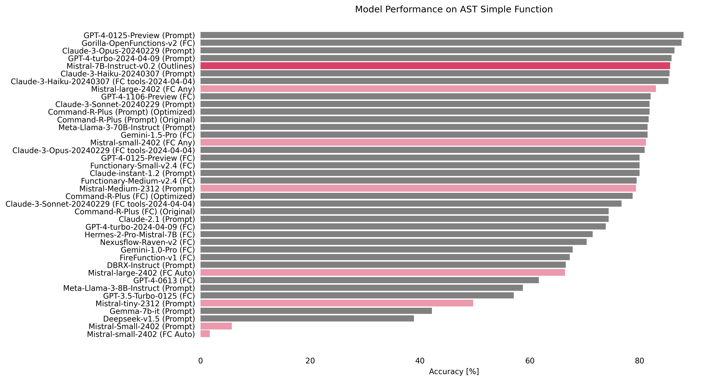
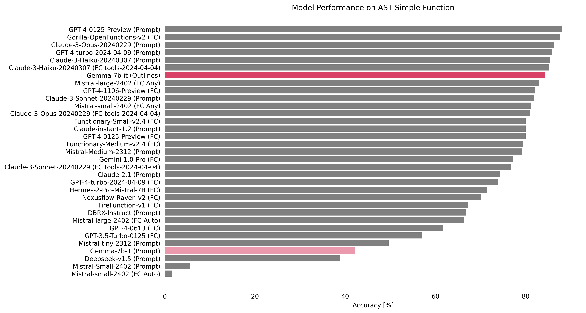
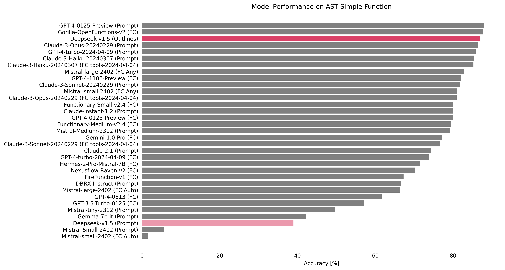
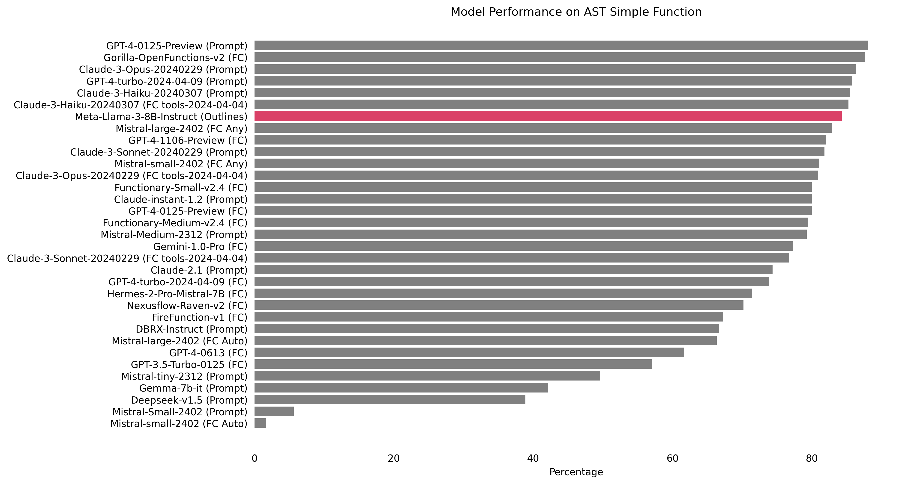

# Outlines Function Calling Evaluation

> [!NOTE]
> This report originates from the [Outlines](https://github.com/outlines-dev/outlines) community's proposal to find a good dataset for evaluating structured generation. If you want to participate, join our [Discord](https://discord.gg/ZxBxyWmW5n).

## Goal

The main goal of this evaluation is to show the power of structured generation in the context of Function Calling, which is the ability of Large Language Models (LLMs) to call functions based on natural language instructions. We focus on the case where the LLM is given a single JSON function document and is expected to make a single function call.

To create this evaluation, we use the [Outlines](https://github.com/outlines-dev/outlines) library, which changes the problem of neural text generation into transitions between states of a finite-state machine[^1]. Outlines allows for the creation of reliable interfaces by ensuring the structure of the generated text.

[^1]: [Willard, B. T., & Louf, R. (2023). Efficient Guided Generation for Large Language Models](https://huggingface.co/papers/2307.09702).

We want to explore some interesting questions: Can structured generation work better than fine-tuning for Function Calling? Can this approach allow smaller open-source models to perform as well as larger, state-of-the-art models? The results of this evaluation will give us valuable insights into the abilities and potential of structured generation in improving the performance of LLMs across various model sizes and architectures, potentially reshaping our understanding of how to optimize  for specific tasks.

## Benchmark

There is a dataset generated from real-world data that has been released[^2] for the construction of the [**Berkeley Function-Calling Leaderboard**](https://gorilla.cs.berkeley.edu/leaderboard.html#leaderboard). It consists of 2,000 question-function-answer pairs across multiple languages, diverse application domains, and complex use cases[^3]. Additionally, it includes the [code to reproduce the benchmark](https://github.com/ShishirPatil/gorilla/tree/main/berkeley-function-call-leaderboard), which serves as a sort of framework for evaluation. If you want to learn more about this outstanding initiative, we recommend reading [this blog post](https://gorilla.cs.berkeley.edu/blogs/8_berkeley_function_calling_leaderboard.html).

[^2]: [Yan, F., Mao, H., Ji, C. C.-J., Zhang, T., Patil, S. G., Stoica, I., & Gonzalez, J. E. (2024). Berkeley Function Calling Leaderboard.](https://gorilla.cs.berkeley.edu/blogs/8_berkeley_function_calling_leaderboard.html)
[^3]: [Patil, S. G., Zhang, T., Wang, X., & Gonzalez, J. E. (2023). Gorilla: Large Language Model Connected with Massive APIs. arXiv preprint arXiv:2305.15334.](https://arxiv.org/abs/2305.15334)

### Data

In the Outlines community, we decided to start with the 'AST Simple' category, as described by the authors:

> Simple Function: The evaluation of a single function includes the simplest but most commonly seen format, where the user provides a single JSON function document. Only one function call will be invoked.

Here is an example from one of the 400 records in this evaluation category:

```python
question = 'Find the area of a triangle with a base of 10 units and height of 5 units.'
```

To answer the question, the LLM has access to the function defined by this JSON Schema:

```json
{
  "title": "calculate_triangle_area",
  "type": "object",
  "description": "Calculate the area of a triangle given its base and height.",
  "properties": {
    "base": {
      "type": "integer",
      "description": "The base of the triangle."
    },
    "height": {
      "type": "integer",
      "description": "The height of the triangle."
    },
    "unit": {
      "type": "string",
      "description": "The unit of measure (defaults to 'units' if not specified)"
    }
  },
  "required": [
    "base",
    "height"
  ]
}
```

The expected response:

```python
calculate_triangle_area(base=10, height=5, unit='units')
```

This is exactly the use case we've been facing in our efforts to integrate LLMs to power software.

### Metric

We use the evaluation process for simple functions within the GFCL framework. This process involves comparing the output of a model directly with the expected function document and potential correct answers. Below is a flowchart that details this step-by-step evaluation process.


Evaluating function calls. Image from [GFCL blog post](https://gorilla.cs.berkeley.edu/blogs/8_berkeley_function_calling_leaderboard.html).>

Then, accuracy is calculated by counting the validated function calls and comparing them with the total number of simple test category cases.

## Methodology

- We deployed a [**Modal** function](modal/transformers_outlines.py) to run open-source models using [Transformers](https://github.com/huggingface/transformers) + [Outlines](https://github.com/outlines-dev/outlines). [Modal](https://modal.com/) is an easy-to-use cloud platform useful to run generative AI models. Soon, we will write in more detail about [our experience deploying structured generation there](https://github.com/aastroza/modal-outlines-examples).
- We created different [model handlers](evals/bfcl/scripts) to run the [Gorilla BFCL evaluation framework](https://github.com/ShishirPatil/gorilla/tree/c6221060a9d50d0c7e7705f1ac95b9e5c4a95252) [April 6, 2024 version] for the `AST simple` evaluation category.
- We [evaluated](evals/bfcl/score) and reported the [results](evals/bfcl/result) comparing them with the [Leaderboard Website](https://github.com/ShishirPatil/gorilla/blob/bdd9d0ac13b6d61ebe1cbfed3903cd16939f1d5f/data.csv) [April 14, 2024 version].

## Results

### Mistral-7B-Instruct-v0.2 (5th, 85.5%)

[Code](../evals/bfcl/scripts/mistral_outlines_handler.py) | [Results](../evals/bfcl/result/mistralai_Mistral-7B-Instruct-v0.2/gorilla_openfunctions_v1_test_simple_result.json) | [Score](../evals/bfcl/score/mistralai_Mistral-7B-Instruct-v0.2/simple_score.json)



Our first intuition was to explore the potential of structured generation in enhancing the performance of a 7B model on the Function Calling task. `Mistral-7B-Instruct-v0.2` achieved an impressive accuracy of 85.5%, securing the 5th position on the leaderboard. Notably, this result stands as the highest score among all Mistral models in the table, suggesting that structured generation may play a significant role in enabling smaller models to tackle complex tasks effectively.

### Gemma-7b-it (from 30th, 42.18% to 7th, 84.25%)

[Code](../evals/bfcl/scripts/gemma_outlines_handler.py) | [Results](../evals/bfcl/result/google_gemma-7b-it/gorilla_openfunctions_v1_test_simple_result.json) | [Score](../evals/bfcl/score/google_gemma-7b-it/simple_score.json)



We wanted to see if a base 7B model could reach the top of the leaderboard by using the power of structured generation. `google/gemma-7b-it` was already the best 7B model on the leaderboard before our tests. However, when we combined it with Outlines, it showed a huge jump in performance. It went from the 34th position with an accuracy of 42.18% to an impressive 7th place, achieving an accuracy of 84.25%. This big improvement highlights the potential of structured generation to boost the performance of base models.

### Deepseek-v1.5 (from 31th, 38.91% to 3rd, 87%)

[Code](../evals/bfcl/scripts/deepseek_outlines_handler.py) | [Results](../evals/bfcl/result/deepseek-ai_deepseek-coder-7b-instruct-v1.5/gorilla_openfunctions_v1_test_simple_result.json) | [Score](../evals/bfcl/score/deepseek-ai_deepseek-coder-7b-instruct-v1.5/simple_score.json)



We tried to directly compare how well structured generation works against fine-tuning. We chose `deepseek-coder-7b-instruct-v1.5`, a model that is used as the base for the fine-tuned Gorilla model. By combining it with Outlines, we saw a remarkable improvement in performance. The model jumped from the 31th position with an accuracy of 38.91% to an amazing 3rd place, achieving an accuracy of 87%. This result is very important because it matches the performance of the fine-tuned `Gorilla-OpenFunctions-v2` model, which is based on the same architecture. The success of this test raises important questions about the different ways to improve model performance. It suggests that structured generation may, in some cases, be a good and efficient alternative to fine-tuning.

### Meta-Llama-3-8B-Instruct (7th, 84.25%)

[Code](../evals/bfcl/scripts/llama_outlines_handler.py) | [Results](../evals/bfcl/result/meta-llama_Meta-Llama-3-8B-Instruct/gorilla_openfunctions_v1_test_simple_result.json) | [Score](../evals/bfcl/score/meta-llama_Meta-Llama-3-8B-Instruct/simple_score.json)



We couldn't resist testing the latest sensation in the world of language models. When combined with structured generation, `Meta-Llama-3-8B-Instruct` achieved an impressive accuracy of 84.25%, securing the 7th position on the leaderboard. 

## Conclusion

Our study shows that structured generation greatly improves how LLMs handle function calling tasks. Through testing, we found that structured generation matches traditional fine-tuning in terms of accuracy and efficiency, especially for smaller models. It also leads to more understanding of complex inputs. Looking ahead, we plan to expand our use of the GFCL benchmark's evaluation categories and explore or develop more diverse datasets.